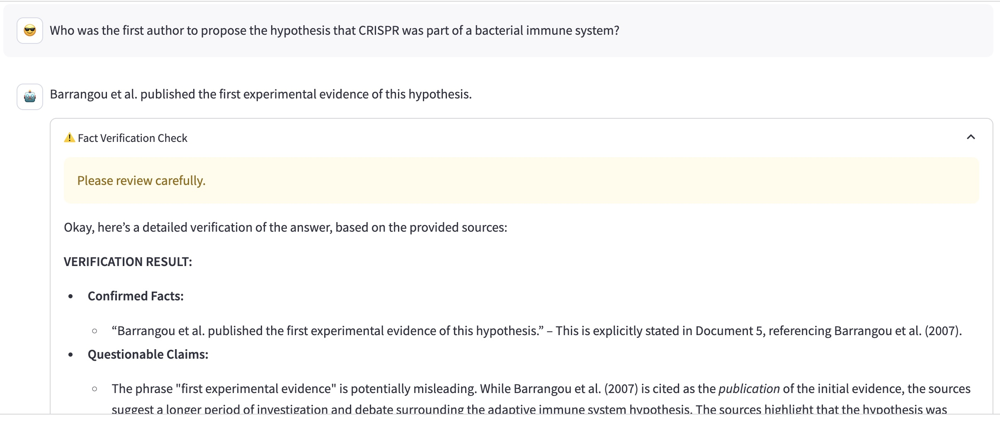
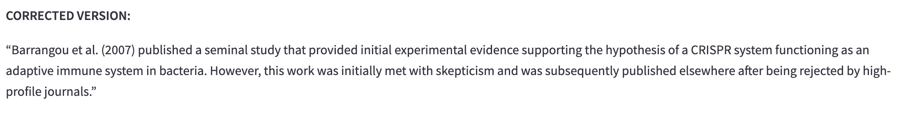
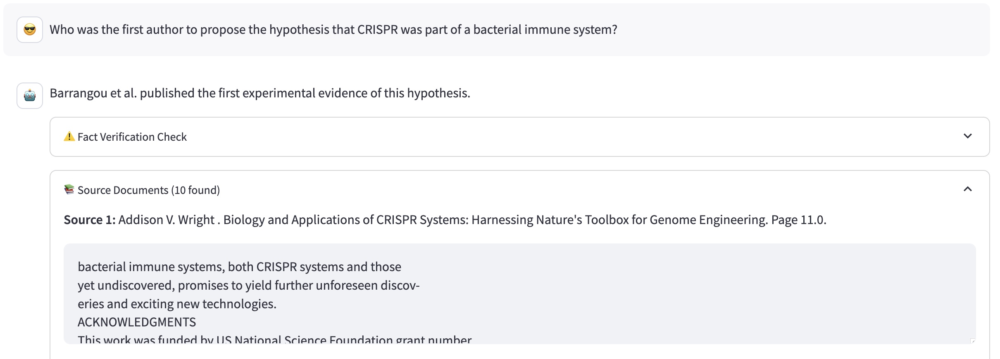
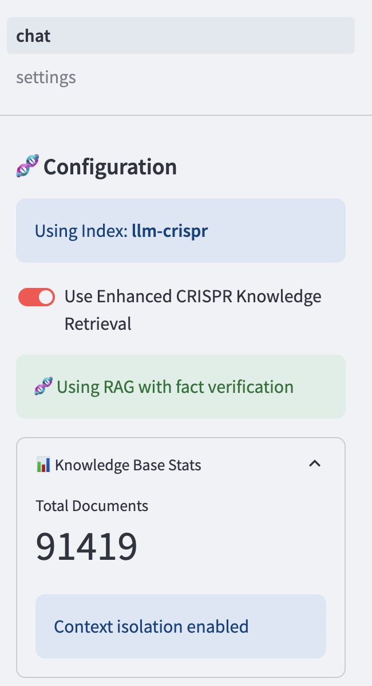

# CRISPR Historian ChatBot

This is a specialized chatbot meant to give more in depth answers on the history of CRISPR as a field.

## Features

- **Interactive UI**: Utilize Streamlit to create a user-friendly interface.
- **Local Model Execution**: Run open source Ollama models locally without the need for API keys.
- **Prompt Chaining**: Uses langchain to decompose questions into specialized subquestions to improve answer quality
- **Fact Verification**: Added module to fact check and improve responses.
- **Retrieval Augmented Generation (RAG)**: This chatbot retrieves from a database of 976 pdfs of research articles on CRISPR

## Prerequisites

### Installing Ollama

If you have root privileges on your machine, Ollama can easily be downloaded [here](https://ollama.com/). The installation instructions should guide you through how to up a server.

**If you don't have root privileges on your machine please read here**

Here, you would have to download ollama in its binary format and run a server using the binary.

```bash
# Create a local bin directory
mkdir -p $HOME/.local/bin

# Download the binary
curl -L https://github.com/ollama/ollama/releases/latest/download/ollama-linux-amd64 -o $HOME/.local/bin/ollama

# Make it executable
chmod +x $HOME/.local/bin/ollama

# Add to PATH (add this to your ~/.bashrc or ~/.zshrc)
export PATH=$HOME/.local/bin:$PATH

# Start a server
ollama serve
```

### Models I used
Personally, I found that `Gemma3` as a generator, and `sentence-transformers/all-MiniLM-L6-v2` worked very well

To install `Gemma3` via ollama:
- If you don't have an ollama server running, first, run `ollama serve`
- In another terminal window, run `ollama pull gemma3:latest`

`all-MiniLM-L6-v2` will automatically be installed from HuggingFace when this app is run for the first time.

## Installation

Before running the app, ensure you have Python installed on your machine. Then, clone this repository and install the required packages using pip:

```bash
git clone https://github.com/vikramr2/crispr_historian_chatbot.git
cd crispr_historian_chatbot
pip install -r requirements.txt
```

## Usage

To start the app, simply run the following command in your terminal:

```bash
./run_chat.sh
```

If a browser hasn't opened automatically, navigate to the URL provided by Streamlit in your browser to interact with the app.

## Features

### Fact Checking

The chatbot first answers the question, and then puts its answer through a fact check in order to refine it.



The fact checking window will then contain a corrected response.



### Source Listing

To ensure credibility in responses, sources are listed under every answer so that you, the historian, can examine these text snippets for further information.



### Dialable Settings

*(While this is not recommended, and was intended for testing purposes)*, you can dial between using the document-informed RAG, and letting the LLM use it's own background knowledge.



## References and Acknowledgments

References:
- This [original repository](https://github.com/tonykipkemboi/ollama_streamlit_demos) served as a great template to build this RAG on top of.
- This [tutorial](https://www.youtube.com/watch?v=bAI_jWsLhFM) was also really helpful.

👏 Kudos to the [Ollama](https://ollama.com/) team for their efforts in making open-source models more accessible!
